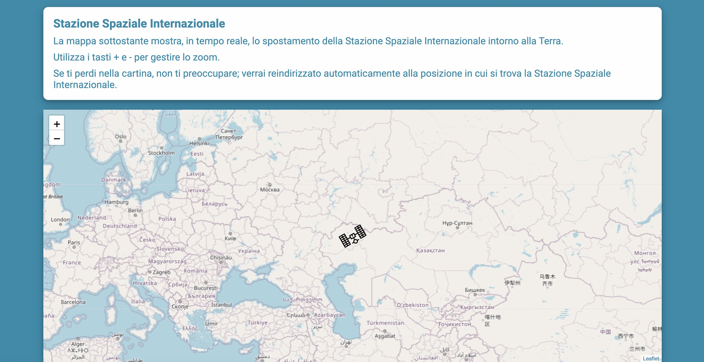
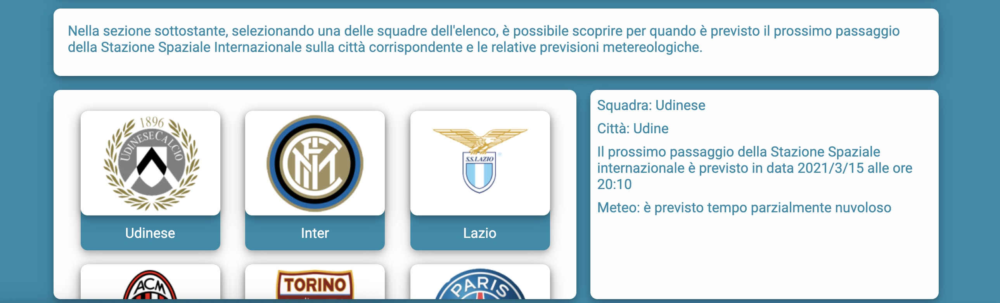
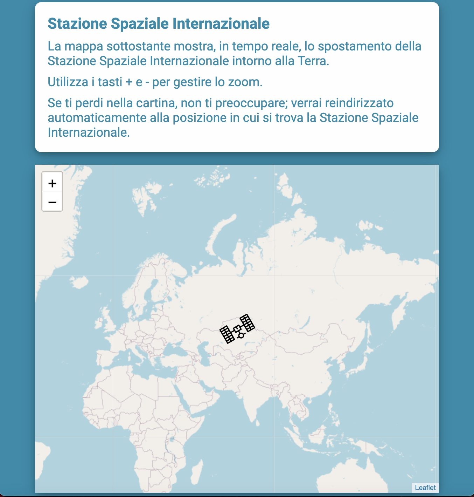

# Stazione Spaziale Internazionale - movimento

## tecnologie
* HTML
* CSS
* JavaScript (Vue.js cli)
* chiamate Axios
* Leaflet (mappa)

## descrizione
Web Application che permette di visualizzare lo spostamento, in tempo reale, della Stazione Spaziale Internazionale attorno alla Terra, con rappresentazione su una mappa.
È inoltre possibile selezionare una squadra di calcio da un elenco; verranno visualizzati data, ora e previsioni climatiche in relazione al prossimo passaggio previsto della Stazione Spaziale Internazionale sulla città della squadra selezionata.

## Prima di iniziare
assicurarsi di poter effettuare chiamate alle API dei seguenti siti:
* http://open-notify.org/Open-Notify-API/
* https://www.metaweather.com
in tal senso, potrebbe tornare utile:
https://chrome.google.com/webstore/detail/cross-domain-cors/mjhpgnbimicffchbodmgfnemoghjakai (per Chrome)

## Project setup
```
npm install
```

```
npm install leaflet vue2-leaflet --save
```

### Compiles and hot-reloads for development
```
npm run serve
```







### Compiles and minifies for production
```
npm run build
```

### Lints and fixes files
```
npm run lint
```

### Customize configuration
See [Configuration Reference](https://cli.vuejs.org/config/).
